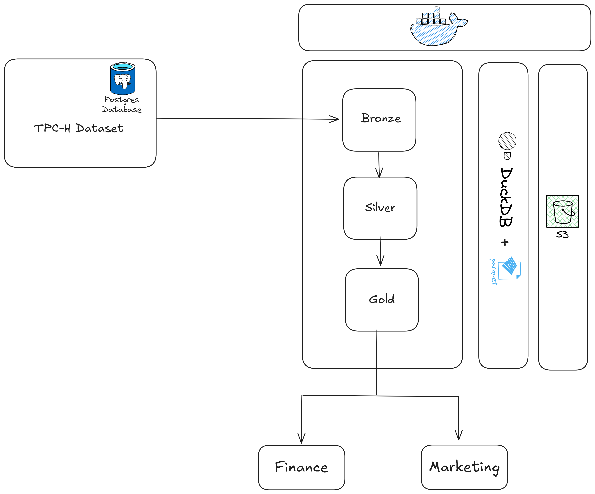

# DuckDB TPC-H Analytics Pipeline with AWS S3

## Introduction

Ce projet implémente un **pipeline analytique complet** basé sur les données **TPC-H**, utilisant **DuckDB** comme moteur de traitement et **AWS S3** comme stockage. L'objectif est de produire des métriques business exploitables dans des outils BI afin de prendre des décisions éclairées.

## Architecture du Pipeline



### 1. Ingestion (Bronze Layer)
- Extraction depuis PostgreSQL via DuckDB
- Chargement initial en mémoire
- Sauvegarde des données brutes sur AWS S3 (format Parquet)

### 2. Transformation (Silver Layer)
- Modélisation dimensionnelle (faits/dimensions)
- Nettoyage et normalisation
- Stockage intermédiaire sur S3

### 3. Agrégation (Gold Layer)
- Calcul des indicateurs clés (One Big table):
  - **Finance**: Revenus, marges, taxes
  - **Marketing**: Segmentation client
- Export vers S3 pour consommation BI

### 4. Interface
- Création de vues métier spécifiques pour :
  - Le département **Finance** (`analytics/etl/interface/finance_views.py`)
  - Le département **Marketing** (`analytics/etl/interface/marketing_views.py`)
- Ces métriques sontimmédiatement disponibles après l'exécution du pipeline, compatible avec des outils BI ou des requêtes directes (ex: AWS Athena/Redshift/QuickSight).

## Stack Technique

| Composant       | Usage                     |
|-----------------|---------------------------|
| DuckDB          | Traitement ETL in-memory  |
| PostgreSQL      | Source TPC-H              |
| AWS S3          | Stockage des données      |
| Docker          | Environnement             |
| Python          | Implémentation            |

## Configuration AWS

### 1. Création du bucket S3

1. Connectez-vous à la console AWS (https://aws.amazon.com/)
2. Allez dans le service S3
3. Cliquez sur "Créer un bucket"
4. Donnez un nom unique à votre bucket (ex: `duckdb-tpch-analytics`)
5. Sélectionnez la région souhaitée (ex: `eu-west-1`)
6. Configurez les options selon vos besoins (versionning, chiffrement, etc.)
7. Cliquez sur "Créer un bucket"

### 2. Configuration des credentials

1. Allez dans IAM > Utilisateurs
2. Créez un utilisateur avec accès programmatique
3. Attachez la politique `AmazonS3FullAccess` (ou une politique plus restrictive)
4. Notez les credentials (Access Key ID et Secret Access Key)


## Démarrage Rapide

### 1. Installation
```bash
git clone https://github.com/abdoul15/duck-analytics-tpch.git
cd duck-analytics-tpch
```

### 2. Configuration des credentials

#### Fichier `.env` à créer dans le dossier `duck-analytics-tpch`

```bash
# Configuration PostgreSQL
POSTGRES_USER=tpchuser
POSTGRES_PASSWORD=tpchpass
POSTGRES_DB=tpchdb

# Configuration S3
S3_ACCESS_KEY=your-access-key
S3_SECRET_KEY=your-secret-key
S3_ENDPOINT=https://s3.amazonaws.com
S3_REGION=eu-west-3
S3_BUCKET=your-bucket-name
```

### 3. Exécution
```bash
make up  # Démarrer les containers
make run-pipeline  # Lancer le pipeline
```

## Accès aux Données

### Via AWS Services
- **Athena**: Interroger directement les données Parquet sur S3
- **Redshift Spectrum**: Créer des tables externes pointant vers S3
- **QuickSight**: Connecteur S3 direct


## Évolution

- Orchestration Step Functions
- Monitoring CloudWatch
- Sécurité IAM fine
